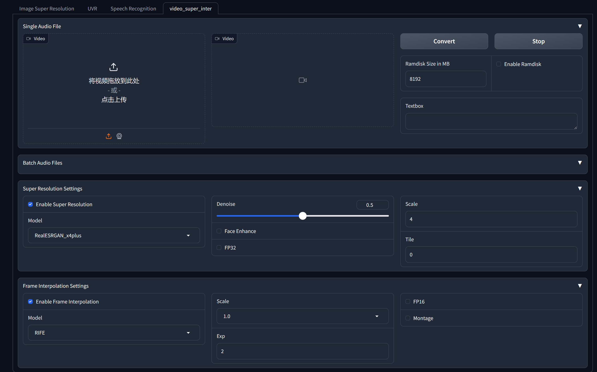

# MediaAIO

<!-- PROJECT LOGO -->
<br />

<p align="center">
  <!-- <a href="https://github.com/shaojintian/Best_README_template/">
    
  </a> -->

  <h3 align="center">MediaAIO</h3>
  <p align="center">
    集成了音视频方面常见的一些开源 ai 模型，旨在为用户提供一个统一的接口，方便用户使用。
    <br />
    <a href="https://github.com/NightWatcher314/MediaAIO"><strong>探索本项目的文档 »</strong></a>
    <br />
    ·
    <a href="https://github.com/NightWatcher314/MediaAIO/issues">报告Bug</a>
    ·
    <a href="https://github.com/NightWatcher314/MediaAIO/issues">提出新特性</a>
  </p>

</p>


## 1. 目录

- [MediaAIO](#mediaaio)
  - [1. 目录](#1-目录)
  - [2. 环境配置](#2-环境配置)
    - [2.1 整体配置](#21-整体配置)
      - [2.1.1 使用 Poetry(建议)](#211-使用-poetry建议)
    - [2.2 部分模型的配置](#22-部分模型的配置)
      - [2.2.1 NAFNET](#221-nafnet)
  - [3. 项目使用](#3-项目使用)
  - [4. 项目示例](#4-项目示例)
    - [4.1 视频部分](#41-视频部分)
      - [4.1.1 视频超分辨率](#411-视频超分辨率)
      - [4.1.2 视频插针](#412-视频插针)
      - [4.1.3 背景分离](#413-背景分离)
    - [4.2 图像部分](#42-图像部分)
      - [4.2.1 图像超分辨率](#421-图像超分辨率)
      - [4.2.2 图像去雾](#422-图像去雾)
      - [4.2.3 图像风格化](#423-图像风格化)
    - [4.3 音频部分](#43-音频部分)
      - [4.3.1 音频增强](#431-音频增强)
      - [4.3.2 音频识别](#432-音频识别)
  - [5. 其余部分](#5-其余部分)
    - [文件目录说明](#文件目录说明)
    - [开发的架构](#开发的架构)
    - [版权说明](#版权说明)
    - [鸣谢](#鸣谢)

## 2. 环境配置

### 2.1 整体配置

请确保你的环境中有 cuda ，本项目目前只在 cuda11.8 上进行过测试。

#### 2.1.1 使用 Poetry(建议)

```bash
git clone --recursive https://github.com/NightWatcher314/MediaAIO
cd MediaAIO
poetry env use "path to your python executable"
poetry install --no-root
```


### 2.2 部分模型的配置

对于部分模型，需要额外的配置：

#### 2.2.1 NAFNET
```bash
cd models/NAFNet
poetry init -n
poetry run pip install -r requirements.txt
poetry run python setup.py develop --no_cuda_ext
```

## 3. 项目使用

请确保在使用前完成相关的环境配置。

```bash
./start.bat
```

## 4. 项目示例

### 4.1 视频部分

#### 4.1.1 视频超分辨率

支持 RealESRGAN 与 RealSR 两类超分辨率模型。



#### 4.1.2 视频插针

支持 RIFE 与 VRT 两类视频插针模型。

#### 4.1.3 背景分离

支持 RobustVideoMatting 背景分离模型。

### 4.2 图像部分

#### 4.2.1 图像超分辨率

支持 RealESRGAN,NAFNet,SWINIR 等超分辨率模型。

#### 4.2.2 图像去雾

支持 HAT,NAFNet,SWINIR 去雾模型。

#### 4.2.3 图像风格化

支持 AnimeGAN,StyleGAN2 风格化模型。

### 4.3 音频部分

#### 4.3.1 音频增强

支持 uvr5 系列的音频分离以及音频增强模型模型。

#### 4.3.2 音频识别

支持 Whisper-Faster 系列的音频识别模型。
对于中文，支持 FunASR 音频识别模型。


## 5. 其余部分

### 文件目录说明

* eg:

```
filetree
├── LICENSE
├── README.md
├── download.py
├── logs
│   └── all
├── models
│   ├── ECCV2022-RIFE
│   ├── HAT
│   ├── NAFNet
│   ├── Real-ESRGAN
│   ├── RobustVideoMatting
│   ├── SwinIR
│   ├── VRT
│   ├── Whisper-Faster
│   ├── audio-separator
│   └── realsr-ncnn-vulkan
├── poetry.lock
├── pyproject.toml
├── pyproject_back.toml
├── src
│   ├── __pycache__
│   ├── config.py
│   ├── gradio_pages
│   ├── test.py
│   ├── utils
│   ├── warp
│   └── webui.py
├── start.bat
├── test_assets
│   ├── audio
│   ├── draw
│   ├── image
│   ├── output
│   └── video
└── verify.bat

```

### 开发的架构

前端部分采用了 gradio ，后端部分主要是利用subprocess或者直接load model来进行推理。

### 版权说明

该项目签署了 BSD 3-Clause 授权许可，详情请参阅 [LICENSE.txt](https://github.com/shaojintian/Best_README_template/blob/master/LICENSE.txt)

### 鸣谢

- [GitHub Emoji Cheat Sheet](https://www.webpagefx.com/tools/emoji-cheat-sheet)
- [Img Shields](https://shields.io)
- [Choose an Open Source License](https://choosealicense.com)
- [GitHub Pages](https://pages.github.com)
- [Animate.css](https://daneden.github.io/animate.css)
- [xxxxxxxxxxxxxx](https://connoratherton.com/loaders)

<!-- links -->

[your-project-path]: shaojintian/Best_README_template
[contributors-shield]: https://img.shields.io/github/contributors/shaojintian/Best_README_template.svg?style=flat-square
[contributors-url]: https://github.com/shaojintian/Best_README_template/graphs/contributors
[forks-shield]: https://img.shields.io/github/forks/shaojintian/Best_README_template.svg?style=flat-square
[forks-url]: https://github.com/shaojintian/Best_README_template/network/members
[stars-shield]: https://img.shields.io/github/stars/shaojintian/Best_README_template.svg?style=flat-square
[stars-url]: https://github.com/shaojintian/Best_README_template/stargazers
[issues-shield]: https://img.shields.io/github/issues/shaojintian/Best_README_template.svg?style=flat-square
[issues-url]: https://img.shields.io/github/issues/shaojintian/Best_README_template.svg
[license-shield]: https://img.shields.io/github/license/shaojintian/Best_README_template.svg?style=flat-square
[license-url]: https://github.com/shaojintian/Best_README_template/blob/master/LICENSE.txt
[linkedin-shield]: https://img.shields.io/badge/-LinkedIn-black.svg?style=flat-square&logo=linkedin&colorB=555
[linkedin-url]: https://linkedin.com/in/shaojintian
